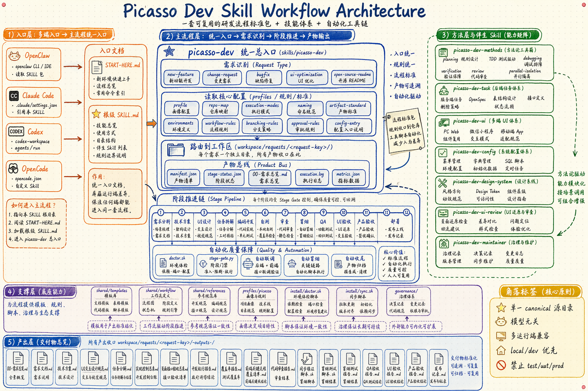

# Picasso Dev Skill

<!-- Keywords: AI development workflow, Claude Code skill, Codex skill, OpenClaw skill, stage-gated delivery, local development, QA automation, multi-platform engineering -->

<div align="center">
  
</div>

<div align="center">
  <strong>把需求、方案、UI、开发、自测、审查、冒烟、QA、验收与发布收敛成一套可执行的 AI 研发工作流</strong>
  <br><br>
  <em>面向 PC Web、微信小程序、移动端 App 与后端，统一入口、阶段门禁、自动联调、全程可追溯。</em>
  <br><br>
  <code>SKILL.md</code> · Claude Code · Codex · OpenClaw · OpenCode
  <br><br>
  一套规则，多种运行端，同一条交付链。
  <br><br>
  如果这个项目对你的研发交付有帮助，公开发布后欢迎点亮一颗 Star。
</div>

<div align="center">
  <a href="#快速开始">快速开始</a> ·
  <a href="./docs/README_en.md">English</a> ·
  <a href="#工作流总览">工作流</a> ·
  <a href="#系统架构">架构</a> ·
  <a href="#常见问题">FAQ</a>
</div>

<div align="center">


[](https://github.com/qierkang/picasso-dev-skill/actions/workflows/ci.yml)
[](https://github.com/qierkang/picasso-dev-skill/stargazers)

</div>

---



---

## 为什么需要 Picasso Dev Skill？

- 需求、技术方案、UI、开发和测试常被拆在不同对话里，交接时缺少统一上下文。
- AI 能生成代码，但没有阶段门禁时容易跳过任务拆解、自测、审查和验收证据。
- PC、小程序、App 与后端需要共享业务口径，同时保留各端专项规则。
- 多个运行端协作时，重复 skill 副本会产生版本漂移和规则冲突。
- 真实工程必须严格隔离 `local/dev` 与 `test/uat/prod`，不能只依赖口头约定。

**Picasso Dev Skill 把上下文、模板、角色、脚本和 Gate 收进同一个 canonical 技能包。**

```text
使用 picasso-dev 开始开发 maintenance-plan
```

| 常见问题 | 本项目的处理方式 |
|---|---|
| 流程只写在文档里 | `doctor.sh`、`stage-gate.py` 和冒烟脚本可执行 |
| 多角色各自维护规则 | 统一入口路由 companion skills |
| 每台机器复制多份 skill | 单一 canonical 源目录 |
| 验收结论不可追踪 | request 目录保存状态、报告与证据 |
| 环境误操作风险 | 固定 `local/dev`，禁止 `test/uat/prod` |

## 项目概述

Picasso Dev Skill 是面向 Picasso 项目研发交付的自包含技能包。它从根级 `SKILL.md` 进入，由 `picasso-dev` 统一识别新需求、需求变更、Bug 修复、UI 优化或开源 README 等任务，再调度后端、UI、配置、方法和维护 companion skills。它不绑定单一模型，支持 Claude Code、Codex、OpenClaw 与 OpenCode 读取同一套规则。

> Picasso Dev Skill is a stage-gated, multi-runtime AI delivery workflow covering requirements, design, implementation, review, QA, acceptance, and release.
>
> If this saves you time, a ⭐ helps others find it.

## 核心特色

- **统一入口与单一源**：根 `SKILL.md` 负责发现，`skills/picasso-dev/` 负责真实主流程。
- **完整阶段门禁**：从需求到发布，每个阶段都有必需产物和放行条件。
- **多端工程支持**：覆盖 PC Web、小程序、移动 App 与后端任务。
- **自动联调与冒烟**：配置本地启动入口后，可自动启动、等待、登录、冒烟和收尾。
- **严格环境边界**：只允许 `local/dev`，显式禁止连接和部署 `test/uat/prod`。

## 与同类方案对比

| 方案 | 完整研发链 | 可执行 Gate | 多端支持 | 多运行端 | 环境边界 |
|---|---:|---:|---:|---:|---:|
| **Picasso Dev Skill** | ✅ | ✅ | ✅ | ✅ | ✅ |
| 单文件编码 skill | ❌ | 部分 | 部分 | 部分 | 不稳定 |
| 通用 Agent 提示词 | 部分 | ❌ | 视上下文 | ✅ | 依赖人工 |
| CI/CD 工具 | 发布侧 | ✅ | ✅ | 非 Agent 工作流 | 环境配置 |

## 工作流总览

| 场景 | 路由 | 关键输出 |
|---|---|---|
| 新需求 | `picasso-dev` | 需求、方案、UI、任务、实现、测试、验收、发布记录 |
| 后端任务 | `picasso-dev-task` | OpenSpec、表结构、接口、服务端任务状态 |
| UI 设计/优化 | `picasso-dev-ui` | 风格、token、交互规范、平台专项文档 |
| UI 审查 | `picasso-dev-ui-review` | 差异清单、问题定位、回流建议 |
| 菜单/字典/SQL | `picasso-dev-config` | 配置与联调依赖 |
| 规则维护 | `picasso-dev-maintainer` | governance 记录与 Changelog |

不确定路由时，从 `picasso-dev` 统一入口开始。

## 快速开始

### 前置条件

- `git`、`python3`。
- 文档能力只需最小工具链；编码能力按项目准备 Java 21、Node.js 20、pnpm 等。
- 使用真实工程前必须通过对应 capability 的 doctor。

```bash
git clone https://github.com/qierkang/picasso-dev-skill.git
cd picasso-dev-skill
cp .env.example .env
bash install/setup.sh
bash install/doctor.sh --capability docs
```

```text
使用 picasso-dev 开始开发 maintenance-plan
原型：
- /path/to/list.html
- /path/to/detail.html
```

<details>
<summary>查看 request 产物结构</summary>

```text
workspace/requests/maintenance-plan/
├── 00-需求总览.md
├── manifest.json
├── 需求文档.md
├── 技术方案.md
├── UI交互设计规范.md
├── 任务分解.md
├── 开发放行报告.md
├── 代码审查报告.md
├── 冒烟测试报告.md
├── QA验收报告.md
├── UI验收报告.md
├── 产品验收报告.md
├── 发布记录.md
└── stage-status.json
```

</details>

## 功能模块

### 主流程与任务层

- `picasso-dev` 负责需求识别、request 初始化和阶段推进。
- `picasso-dev-task` 负责服务端设计、OpenSpec、接口与状态管理。
- `picasso-dev-methods` 提供规划、TDD、排障、验证、审查和隔离方法。

### UI 与配置层

- `picasso-dev-ui` 路由 Web、小程序、iOS、Android 专项设计规则。
- `picasso-dev-design-system` 提供 token、组件、动效和可访问性基线。
- `picasso-dev-ui-review` 负责实现后的 UI 差异审查。
- `picasso-dev-config` 管理菜单、字典、SQL 与环境配置协同。

### 治理与适配层

- `picasso-dev-maintainer` 维护版本、规则和更新记录。
- `.claude-plugin/`、`.codex/`、`.opencode/`、`.openclaw/` 仅做运行端适配。
- `shared/` 保存模板、规则、脚本和工作流，禁止依赖宿主机外部副本。

## 技术栈

| 层级 | 技术或资产 | 说明 |
|---|---|---|
| 技能入口 | `SKILL.md` + companion skills | 路由与能力分工 |
| 流程状态 | `manifest.json` / `stage-status.json` | 可恢复、可审计 |
| 自动门禁 | Python / Bash | doctor、stage gate、冒烟与验证 |
| 工程能力 | Java / Node.js / pnpm / Flutter | 按实际项目启用 |
| 模板与规则 | Markdown / YAML / JSON | 需求、方案、测试、验收 |
| 视觉资产 | `image_gen` | README 与设计视觉 |
| README gate | `scripts/readme-gate.py` | 双语开源文档校验 |

## 系统架构

### 工作流设计

```text
Root SKILL.md
  -> picasso-dev unified entry
     -> inspect request + load profile/rules
     -> workspace/requests/<request-key>/
     -> requirements -> technical design -> UI -> tasks
     -> implementation -> self-test -> review -> smoke
     -> QA -> UI acceptance -> product acceptance -> release
  -> companion skills + executable gates + governance
```

### 架构说明

- 主流程层负责阶段推进，方法层提供可复用工程方法。
- 适配层只解释运行端接入，不复制第二套流程。
- `workspace/` 默认不提交；`governance/` 保存稳定变更。
- graphify 可用于代码地图，但纯文档改造不强制重建。


## 目录结构

```text
├── SKILL.md
├── skills/picasso-dev*/
├── profiles/picasso/
├── shared/{templates,references,workflow,scripts}/
├── install/
├── governance/
├── examples/
├── assets/
├── docs/
├── workspace/
└── .{claude-plugin,codex,opencode,openclaw}/
```

## 命令参考

| 命令 | 说明 |
|---|---|
| `bash install/setup.sh` | 初始化目录和本地配置 |
| `bash install/doctor.sh --capability docs` | 检查文档能力 |
| `bash install/doctor.sh --capability dev` | 检查编码工具链 |
| `bash install/doctor.sh --capability db` | 检查本地数据库边界 |
| `bash install/doctor.sh --capability deploy` | 检查本地启动与冒烟编排 |
| `python3 shared/scripts/stage-gate.py <stage> ...` | 执行阶段放行检查 |
| `bash install/sync.sh` | 清理历史外部副本，保留 canonical 源 |

## 开发指南

### 新需求和变更

使用英文 request key；日期只保留在 manifest 元信息中。需求变更必须回到对应阶段，不能直接跳过 Gate。

### UI 设计

运行端可识别 `ui-ux-pro-max` 时优先协同；不可识别时只回退到 `shared/references/design/`。

### 安全边界

- 禁止访问 `test/uat/prod`。
- 禁止提交真实 `.env`、客户数据和 `workspace/` 运行产物。
- 禁止把主流程改成依赖宿主机外部 skill。

## 开发与验证

```bash
bash install/doctor.sh --capability docs
python3 shared/scripts/readme-gate.py README.md
python3 scripts/readme-gate.py --readme README.md
python3 scripts/readme-gate.py --readme docs/README_en.md
bash -n install/*.sh shared/scripts/*.sh
```

对应 capability 必须无 `FAIL`；README、脚本和资产校验全部退出 `0` 才算通过。

## 项目状态

| 项目 | 当前值 |
|---|---|
| 版本 | `0.3.13` |
| 状态 | Active |
| canonical source | 当前仓库 |
| 支持运行端 | Claude Code / Codex / OpenClaw / OpenCode |
| 环境边界 | `local/dev` only |
| 已知风险 | 使用真实工程前仍需正确配置 `.env` 和本地代码路径 |

## 常见问题

<details>
<summary>为什么不用日期作为需求目录名？</summary>

需求常跨多天，英文代号更适合续写、恢复和跨 Agent 交接。
</details>

<details>
<summary>为什么 workspace 默认不提交？</summary>

其中可能包含真实需求、日志和客户数据；仓库只提交模板、规则、示例与治理记录。
</details>

<details>
<summary>没有 Claude Code 或 Codex 可以使用吗？</summary>

可以。只要运行端能读取 `SKILL.md` 和仓库文件，OpenClaw 或 OpenCode 也可进入同一流程。
</details>

<details>
<summary>能否连接测试或生产环境？</summary>

不能。当前技能包固定为 `local-only`，只允许 `local/dev`。
</details>

## 参与贡献

- Issue 应说明需求类型、目标平台、阶段和复现材料。
- 规则修改必须补 `governance/updates/` 记录。
- 脚本修改必须提供可执行验证。
- PR 前执行 doctor、README gate 与 shell syntax check。

详见 [CONTRIBUTING.md](./CONTRIBUTING.md)。English contributors can use [docs/README_en.md](./docs/README_en.md).

## 版本说明

| 版本 | 主要变化 |
|---|---|
| `0.3.13` | 内化开源 README 工作流与门禁 |
| `0.3.12` | 收敛为单一 canonical skill 源目录 |
| `0.3.10` | 加硬 UI fallback，仅允许内置设计规则 |
| `0.3.3` | 增加自动联调、冒烟和收尾 |
| `0.1.0` | 初始化技能包与统一入口 |

完整记录见 [CHANGELOG.md](./CHANGELOG.md) 与 [governance/CHANGELOG.md](./governance/CHANGELOG.md)。

## 致谢

本项目的方法层参考了 TDD、系统化排障、完成前验证和 Harness Engineering 的公开实践，并通过 Picasso 真实研发链路持续校验。

## Star History · Star 历史

公开仓库首次发布后，将通过 `platform-project-skill/scripts/add-star-history.sh` 写入真实图表。

<!-- star-history:start -->
Star History will be added after the first public push.
<!-- star-history:end -->

## 许可证

本项目采用 [MIT License](./LICENSE)。

## 作者

- Email: `xyqierkang@gmail.com`
- GitHub: [qierkang](https://github.com/qierkang)
