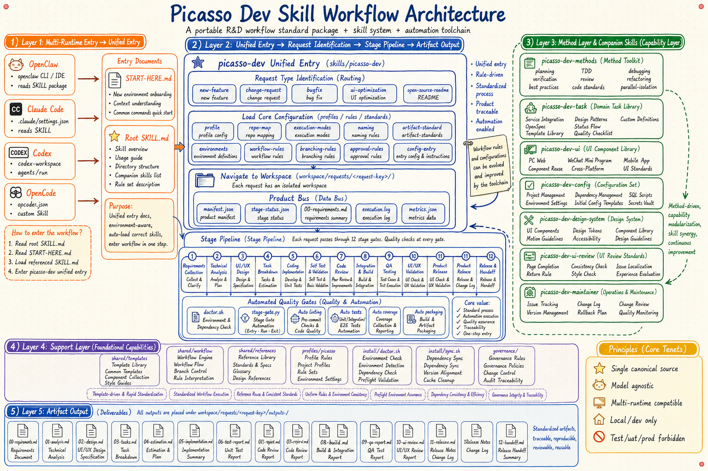

# Picasso Dev Skill

<!-- Keywords: AI development workflow, Claude Code skill, Codex skill, OpenClaw skill, stage-gated delivery, local development, QA automation -->

<div align="center">
  
</div>

<div align="center">
  <strong>A stage-gated AI engineering workflow for requirements, design, implementation, review, QA, acceptance, and release</strong>
  <br><br>
  <em>One unified entry for PC Web, Mini Programs, mobile apps, and backend delivery with executable gates and traceable artifacts.</em>
  <br><br>
  <code>SKILL.md</code> · Claude Code · Codex · OpenClaw · OpenCode
  <br><br>
  One rule set, multiple runtimes, one delivery chain.
  <br><br>
  If this improves your delivery workflow, consider starring it after the public release.
</div>

<div align="center">
  <a href="#quick-start">Quick Start</a> ·
  <a href="../README.md">简体中文</a> ·
  <a href="#workflow-overview">Workflow</a> ·
  <a href="#system-architecture">Architecture</a> ·
  <a href="#faq">FAQ</a>
</div>

<div align="center">


[](https://github.com/qierkang/picasso-dev-skill/actions/workflows/ci.yml)
[](https://github.com/qierkang/picasso-dev-skill/stargazers)

</div>

---



---

## Why Picasso Dev Skill?

- Requirements, technical design, UI, implementation, and tests often live in disconnected conversations.
- AI can write code while silently skipping task breakdown, self-test, review, or acceptance evidence.
- PC, Mini Program, mobile, and backend delivery need shared business rules plus platform-specific guidance.
- Multiple copied skill packages create version drift across runtimes.
- Real engineering must enforce the boundary between `local/dev` and `test/uat/prod`.

**Picasso Dev Skill keeps context, templates, roles, scripts, and quality gates in one canonical package.**

```text
Use picasso-dev to start maintenance-plan.
```

| Common failure | This project |
|---|---|
| Workflow exists only in prose | Executable doctor, stage gate, and smoke scripts |
| Every role owns separate rules | Companion skills behind one entry |
| Skill copies drift by machine | One canonical source |
| Acceptance lacks evidence | Request folders retain status and reports |
| Environment mistakes | `local/dev` allowed; `test/uat/prod` forbidden |

## Project Overview

Picasso Dev Skill is a self-contained delivery package for Picasso engineering work. The root `SKILL.md` provides discovery, while `picasso-dev` routes features, changes, bug fixes, UI work, and documentation tasks to backend, UI, configuration, method, and maintenance companion skills. It is model-agnostic and supports Claude Code, Codex, OpenClaw, and OpenCode reading the same rules.

> Picasso Dev Skill is a stage-gated, multi-runtime AI delivery workflow covering requirements, design, implementation, review, QA, acceptance, and release.
>
> If this saves you time, a ⭐ helps others find it.

## Core Features

- **Unified entry and canonical source** separate discovery from the real workflow without duplicating rules.
- **Full stage gates** define required artifacts and release conditions from requirements through release.
- **Multi-platform engineering** covers PC Web, Mini Programs, mobile apps, and backend tasks.
- **Automated integration and smoke checks** can start services, wait for readiness, log in, test, and clean up.
- **Strict environment boundary** allows only `local/dev` and forbids `test/uat/prod`.

## Comparison

| Approach | Full delivery chain | Executable gates | Multi-platform | Multi-runtime | Environment boundary |
|---|---:|---:|---:|---:|---:|
| **Picasso Dev Skill** | ✅ | ✅ | ✅ | ✅ | ✅ |
| Single coding skill | ❌ | Partial | Partial | Partial | Unstable |
| Generic agent prompt | Partial | ❌ | Context-dependent | ✅ | Manual |
| CI/CD tooling | Release-focused | ✅ | ✅ | Not an agent workflow | Config-based |

## Workflow Overview

| Scenario | Route | Key output |
|---|---|---|
| New feature | `picasso-dev` | Requirements, design, UI, tasks, implementation, tests, acceptance, release |
| Backend task | `picasso-dev-task` | OpenSpec, schema, APIs, task state |
| UI design or optimization | `picasso-dev-ui` | Style, tokens, interactions, platform guidance |
| UI review | `picasso-dev-ui-review` | Diffs, issue localization, feedback |
| Menu/dictionary/SQL | `picasso-dev-config` | Configuration and integration dependencies |
| Package maintenance | `picasso-dev-maintainer` | Governance records and changelog |

Start with `picasso-dev` when the route is unclear.

## Quick Start

### Prerequisites

- `git` and `python3`.
- Documentation work needs only the minimal toolchain.
- Coding may require Java 21, Node.js 20, pnpm, and project-specific tools.

```bash
git clone https://github.com/qierkang/picasso-dev-skill.git
cd picasso-dev-skill
cp .env.example .env
bash install/setup.sh
bash install/doctor.sh --capability docs
```

```text
Use picasso-dev to start maintenance-plan.
Prototypes:
- /path/to/list.html
- /path/to/detail.html
```

<details>
<summary>Request artifact layout</summary>

```text
workspace/requests/maintenance-plan/
├── 00-requirements-overview.md
├── manifest.json
├── requirements.md
├── technical-design.md
├── ui-interaction-spec.md
├── task-breakdown.md
├── development-release-report.md
├── code-review-report.md
├── smoke-test-report.md
├── qa-acceptance-report.md
├── ui-acceptance-report.md
├── product-acceptance-report.md
├── release-record.md
└── stage-status.json
```

</details>

## Modules

### Core workflow and task layer

- `picasso-dev` identifies requests, initializes workspaces, and advances stages.
- `picasso-dev-task` handles backend design, OpenSpec, APIs, and task state.
- `picasso-dev-methods` provides planning, TDD, debugging, verification, review, and isolation.

### UI and configuration layer

- `picasso-dev-ui` routes Web, Mini Program, iOS, and Android design guidance.
- `picasso-dev-design-system` defines tokens, components, motion, and accessibility.
- `picasso-dev-ui-review` compares implementation against the design baseline.
- `picasso-dev-config` handles menus, dictionaries, SQL, and environment configuration.

### Governance and adapters

- `picasso-dev-maintainer` owns package versions, rules, and update records.
- Runtime adapter folders explain integration without copying the main workflow.
- `shared/` contains templates, rules, scripts, and workflows with no host-level dependency.

## Technology Stack

| Layer | Technology or asset | Purpose |
|---|---|---|
| Skill entry | `SKILL.md` + companion skills | Routing and capability ownership |
| Process state | `manifest.json` / `stage-status.json` | Recovery and auditability |
| Gates | Python / Bash | Doctor, stage validation, smoke tests |
| Engineering | Java / Node.js / pnpm / Flutter | Enabled by the target project |
| Templates | Markdown / YAML / JSON | Requirements through acceptance |
| Visuals | `image_gen` | README and design visuals |
| README gate | `scripts/readme-gate.py` | Bilingual documentation validation |

## System Architecture

### Workflow Design

```text
Root SKILL.md
  -> picasso-dev unified entry
     -> inspect request + load profile/rules
     -> workspace/requests/<request-key>/
     -> requirements -> technical design -> UI -> tasks
     -> implementation -> self-test -> review -> smoke
     -> QA -> UI acceptance -> product acceptance -> release
  -> companion skills + executable gates + governance
```

### Architecture Notes

- The core workflow advances stages; the method layer supplies reusable engineering practices.
- Runtime adapters document integration and never duplicate the main workflow.
- `workspace/` is ignored by default, while `governance/` retains stable package changes.
- graphify is useful for code maps but is not rebuilt for documentation-only changes.


## Directory Structure

```text
├── SKILL.md
├── skills/picasso-dev*/
├── profiles/picasso/
├── shared/{templates,references,workflow,scripts}/
├── install/
├── governance/
├── examples/
├── assets/
├── docs/
├── workspace/
└── .{claude-plugin,codex,opencode,openclaw}/
```

## Command Reference

| Command | Purpose |
|---|---|
| `bash install/setup.sh` | Initialize directories and local configuration |
| `bash install/doctor.sh --capability docs` | Validate documentation capability |
| `bash install/doctor.sh --capability dev` | Validate coding toolchain |
| `bash install/doctor.sh --capability db` | Validate local database boundary |
| `bash install/doctor.sh --capability deploy` | Validate local service orchestration |
| `python3 shared/scripts/stage-gate.py <stage> ...` | Run a stage release gate |
| `bash install/sync.sh` | Remove historical external copies |

## Development Guide

### Features and changes

Use an English request key. Dates belong in manifest metadata, not the request directory name. Changes return to the affected stage.

### UI design

Use `ui-ux-pro-max` when available. Otherwise, fall back only to `shared/references/design/`.

### Safety boundaries

- Never access `test/uat/prod`.
- Never commit real `.env`, customer data, or runtime `workspace/` files.
- Never make the main workflow depend on host-level external skills.

## Development and Validation

```bash
bash install/doctor.sh --capability docs
python3 shared/scripts/readme-gate.py README.md
python3 scripts/readme-gate.py --readme README.md
python3 scripts/readme-gate.py --readme docs/README_en.md
bash -n install/*.sh shared/scripts/*.sh
```

The selected doctor capability must have no `FAIL`, and README, shell, and asset checks must exit with `0`.

## Project Status

| Item | Current value |
|---|---|
| Version | `0.3.13` |
| Status | Active |
| Canonical source | This repository |
| Runtimes | Claude Code / Codex / OpenClaw / OpenCode |
| Environment | `local/dev` only |
| Known risk | Real projects still require correct `.env` and source paths |

## FAQ

<details>
<summary>Why not use dates as request directory names?</summary>

Requests often span multiple days. Stable English keys work better for recovery and multi-agent handoff.
</details>

<details>
<summary>Why is workspace ignored?</summary>

It may contain real requirements, logs, and customer data. The repository tracks templates, rules, examples, and governance.
</details>

<details>
<summary>Can I use it without Claude Code or Codex?</summary>

Yes. OpenClaw or OpenCode can use the same workflow if they can read `SKILL.md` and repository files.
</details>

<details>
<summary>Can it connect to test or production?</summary>

No. The current package is fixed to `local-only` and permits only `local/dev`.
</details>

## Contributing

- Issues should include request type, target platform, stage, and reproduction material.
- Rule changes require a `governance/updates/` record.
- Script changes require executable verification.
- Run doctor, README gates, and shell syntax checks before a PR.

See [CONTRIBUTING.md](../CONTRIBUTING.md).

## Version History

| Version | Main changes |
|---|---|
| `0.3.13` | Internalized open-source README workflow and gate |
| `0.3.12` | Consolidated to one canonical skill source |
| `0.3.10` | Hardened UI fallback to internal design rules only |
| `0.3.3` | Added automated integration, smoke, and cleanup |
| `0.1.0` | Initialized the package and unified entry |

See [CHANGELOG.md](../CHANGELOG.md) and [governance/CHANGELOG.md](../governance/CHANGELOG.md).

## Acknowledgements

The method layer draws from public practices in TDD, systematic debugging, verification-before-completion, and Harness Engineering, validated through real Picasso delivery workflows.

## Star History · Star 历史

The verified chart will be added with `platform-project-skill/scripts/add-star-history.sh` after the first public push.

<!-- star-history:start -->
Star History will be added after the first public push.
<!-- star-history:end -->

## License

Released under the [MIT License](../LICENSE).

## Author

- Email: `xyqierkang@gmail.com`
- GitHub: [qierkang](https://github.com/qierkang)
